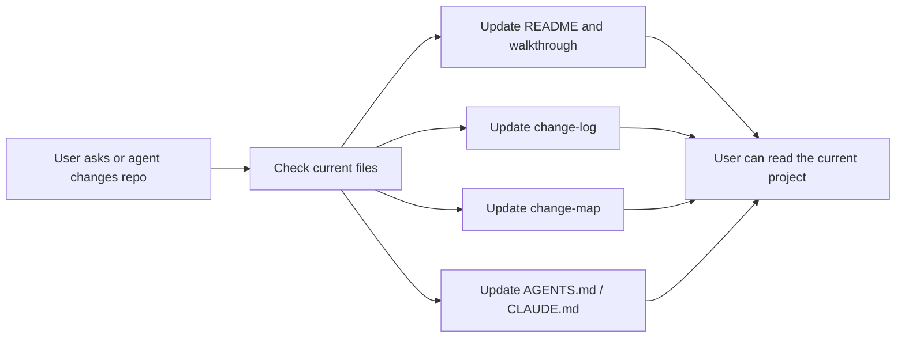

<div align="center">
  <h1>
    
    Repo-Docs:
  </h1>
  <h3>Keep up with the code your agents write.</h3>
</div>

<p align="center">
  Vibe coding makes projects grow quickly. Repo-Docs keeps the explanation,
  decisions, progress, and next steps close to the code.
</p>

<p align="center">
  <a href="#latest-updates">Latest Updates</a> ·
  <a href="#what-is-repo-docs">What is Repo-Docs?</a> ·
  <a href="#demonstration">Demonstration</a> ·
  <a href="#quick-start">Quick Start</a> ·
  <a href="#quality-bar">Quality Bar</a>
</p>

<p align="center">
  <a href="README.md">English</a> ·
  <a href="README_CN.md">中文 README</a>
</p>

---

## Latest Updates

> New: walkthrough-first repo docs, root-level `repo-docs/` output, Chinese
> docs support, and Seed mode for empty repos. If Repo-Docs helps you keep up
> with an agent-built project, a GitHub star 🌟 helps more builders find it.

- **2026-06-23**: Added Chinese overlay support through `repo-docs-zh`.
- **2026-06-23**: Added walkthrough-first docs through
  `repo-docs/walkthroughs/one-real-run.md`.
- **2026-06-23**: Published the first README structure, repo-docs contract,
  reference standard, and example prompt.

## What is Repo-Docs?

Vibe coding makes code appear quickly. Files change, decisions move, and the
reason behind a design can stay behind in chat. After a few sessions, the repo
may still run, but the user can no longer see the full shape of what was built.

`repo-docs` is a small agent skill for reducing that gap. It asks the coding
agent to keep living repo docs as work happens, starting from one real
walkthrough: what the user can observe, how the code/data/state move, what
changed, why it changed, what is decided, what is only planned, and what still
needs verification.

## Why It Matters

| Without `repo-docs` | With `repo-docs` |
| --- | --- |
| Code changes faster than the user can follow | The explanation stays beside the code |
| Decisions disappear into chat | Decisions stay in the project |
| Progress is hard to reconstruct | Milestones are recorded in `change-log.md` |
| Plans and facts blur together | Planned, decided, implemented, and unknown items stay separate |
| Returning to the repo means rereading everything | `repo-docs/` shows the current project state |

## What It Does

| It keeps | So you can |
| --- | --- |
| **Repo docs** | understand what the repo is and how it works now |
| **Real walkthrough** | trace one command, request, task, or failure end to end |
| **Progress log** | see what changed and why it changed |
| **Change map** | know what to do next and how to check it |

## Demonstration

A normal coding-agent session becomes a documentation loop:



After a milestone, Repo-Docs leaves the repo easier to continue:

| File | What it preserves |
| --- | --- |
| `repo-docs/README.md` | Current project explanation |
| `repo-docs/walkthroughs/one-real-run.md` | One real behavior path from entry to output |
| `repo-docs/change-log.md` | What changed, why, and how it was verified |
| `repo-docs/change-map.md` | Next edits, likely files, risks, and checks |
| `AGENTS.md` / `CLAUDE.md` | Rules for the next coding agent |

## Quick Start

There are two common ways to install the skill.

### Natural-language install

Give this project link to your coding agent:

```text
Install the repo-docs skill from this project:
https://github.com/YurunChen/Repo-Docs

Make both repo-docs and repo-docs-zh available in my agent skill directory.
```

### Command install

From this project directory, copy the skill files into your agent skill
directory:

```bash
mkdir -p ~/.agents/skills/repo-docs
cp SKILL.md REFERENCE.md EXAMPLES.md ~/.agents/skills/repo-docs/
mkdir -p ~/.agents/skills/repo-docs-zh
cp repo-docs-zh/SKILL.md ~/.agents/skills/repo-docs-zh/SKILL.md
```

Then invoke it naturally:

```text
Create Chinese repo docs for this repository.
```

## Modes

| Mode | Use it when | Output focus |
| --- | --- | --- |
| **Seed** | The project is new or nearly empty | Goals, decisions, planned work, unknowns |
| **Build** | The repo needs its first docs | One real walkthrough, module map, contracts |
| **Sync** | Code, docs, data, scripts, or experiments changed | Current docs match the repo |
| **Question refinement** | A repo question reveals missing knowledge | Patch the docs, then answer from evidence |

## Example Prompt

Use this once when a project needs its first repo docs:

```text
Use the repo-docs skill to create docs for this repository.
```

After that, keep working naturally. During normal conversations, the agent
should decide when code changes, architecture questions, stale explanations, or
milestone handoffs require updating `repo-docs/`, `change-log.md`,
`change-map.md`, and repo agent instructions.

## What It Produces

The default output is a Markdown docs package under the generated `repo-docs/`
directory:

```text
repo-docs/
  README.md
  walkthroughs/
    one-real-run.md      # required for non-Seed repos
  glossary.md
  flows.md              # optional cross-workflow/state map
  change-map.md
  change-log.md
  modules/
  references/
```

For seed projects, the generated docs stay smaller:

```text
repo-docs/
  README.md
  change-map.md
  change-log.md
  glossary.md                 # optional
  references/
    decisions.md              # optional
```

## Built For

- people who want to stay in control while using coding agents
- projects that change faster than they can be explained in chat
- users who want to review and steer agent-built code
- benchmark, eval, experiment, and prompt-heavy repos
- new repos that need a memory baseline before code exists
- maintainers who want the repo to explain itself

## Documentation Sync Model

`repo-docs` keeps three project-knowledge layers in sync during normal work:

| Layer | Audience | Responsibility |
| --- | --- | --- |
| `README.md` and `repo-docs/` | Users, teammates, future agents | Architecture, walkthroughs, onboarding, operations, examples, contracts, references |
| Root `AGENTS.md` / `CLAUDE.md` | Future agents inside the repo | Hard boundaries, commands, environment rules, red lines, repo-docs policy |
| Agent memory, when available | The agent across sessions | User preferences, recent lessons, cross-project pointers |

Docs become the authority for current project understanding. Memory stays thin
and pointer-oriented.

## What's Included

```text
repo-docs/
├── README.md
├── README_CN.md
├── SKILL.md
├── REFERENCE.md
├── EXAMPLES.md
└── repo-docs-zh/
    └── SKILL.md
```

| File | Purpose |
| --- | --- |
| `README.md` | English project homepage and quick start. |
| `README_CN.md` | Chinese project homepage and quick start. |
| `SKILL.md` | Main skill entrypoint: triggers, modes, repo-docs shape, writing standard, and verification checklist. |
| `REFERENCE.md` | Detailed standards for evidence discovery, seed projects, document types, sync strategy, and quality checks. |
| `EXAMPLES.md` | Lightweight output skeletons for repo docs, walkthroughs, module docs, and follow-up behavior. |
| `repo-docs-zh/SKILL.md` | Chinese-language overlay for repo docs written in Chinese. |

## Quality Bar

A good `repo-docs/` docs package is useful after the chat ends. A newcomer should be
able to read it and explain the repo in their own words, trace one real
workflow from observable entry to output, identify the important contracts, and
know where to make a safe change.

Important claims should be marked by confidence:

- `Confirmed`: backed by code, tests, config, data, docs, or artifacts
- `Inferred`: reasoned from nearby evidence and named as inference
- `Unknown` / `未确认`: awaiting verification

For seed projects, planned work must stay visibly separate from implemented
facts.

## Acknowledgements

- [codebase-to-course](https://github.com/zarazhangrui/codebase-to-course)
- [neat-freak](https://github.com/KKKKhazix/khazix-skills)

## Support

If Repo-Docs helps you keep up with the code your agents create, a GitHub star 🌟
helps others find it.

---

<div align="center">
  <p><strong>Repo-Docs:</strong> Keep up with the code your agents write.</p>
  
  <p><em>Thanks for visiting Repo-Docs.</em></p>
  
</div>
