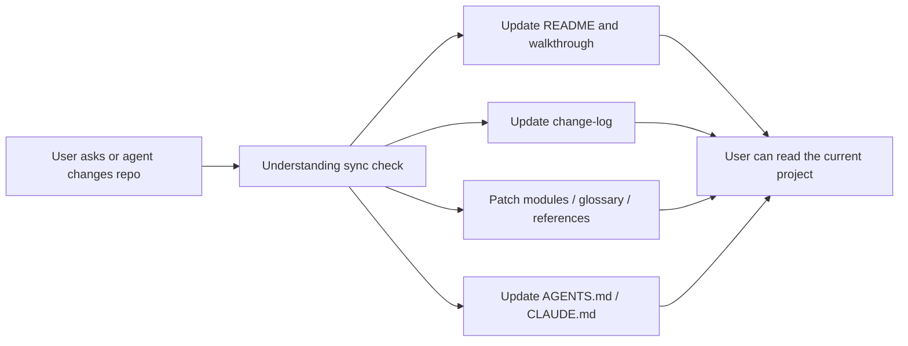

<div align="center">
  <h1>
    Repo-Docs: Keep up with the code your agents write.
  </h1>
</div>

<p align="center">
  Vibe coding makes projects grow quickly. Repo-Docs keeps the explanation,
  decisions, progress, and next steps close to the code.
</p>

<p align="center">
  <a href="#latest-updates">Latest Updates</a> ·
  <a href="#what-is-repo-docs">What is Repo-Docs?</a> ·
  <a href="#demonstration">Demonstration</a> ·
  <a href="#quick-start">Quick Start</a> ·
  <a href="#quality-bar">Quality Bar</a>
</p>

<p align="center">
  <a href="README.md">English</a> ·
  <a href="README_CN.md">中文 README</a>
</p>

<p align="center">
  
</p>

---

## Latest Updates

> New: walkthrough-first repo docs, root-level `repo-docs/` output, Chinese
> docs support, and Seed mode for empty repos. If Repo-Docs helps you keep up
> with an agent-built project, a GitHub star 🌟 helps more builders find it.

- **2026-06-23**: Added Chinese overlay support through `repo-docs-zh`.
- **2026-06-23**: Added walkthrough-first docs through
  `repo-docs/walkthroughs/one-real-run.md`.
- **2026-06-23**: Published the first README structure, repo-docs contract,
  reference standard, and example prompt.

## What is Repo-Docs?

Vibe coding makes code appear quickly. Files change, decisions move, and the
reason behind a design can stay behind in chat. After a few sessions, the repo
may still run, but the user can no longer see the full shape of what was built.

`repo-docs` is a small agent skill for reducing that gap. It asks the coding
agent to keep living repo docs as work happens, starting from one real
walkthrough: what the user can observe, how the code/data/state move, what
changed, why it changed, what is decided, what is only planned, and what still
needs verification.

## What It Does

Repo-Docs starts with one thing the repo really does. It follows that behavior
end to end, names the few ideas that matter, then points to the code and checks
that prove the path. A reader should understand the behavior before memorizing
paths.

The explanation stays in the tree. Docs land in `repo-docs/` as plain Markdown:
a walkthrough, concept pages, a glossary, and lookup tables. The next person
should be able to open the repo cold and keep going.

Docs move with the code. When the repo shifts, or a question shows the write-up
is behind reality, the skill patches the smallest page that fixes the
misunderstanding in the same conversation.

Questions improve the guide. If the answer is not in the docs yet, the skill
reads source, updates the right page, and replies with the page that now owns
that understanding. For Chinese docs, `repo-docs-zh` keeps Chinese as the
explanation language and source terms as lookup anchors.

## Demonstration

A normal coding-agent session becomes a documentation loop:



After a milestone, Repo-Docs leaves the repo easier to continue:

| File | What it preserves |
| --- | --- |
| `repo-docs/README.md` | Current project explanation |
| `repo-docs/walkthroughs/one-real-run.md` | One real behavior path from entry to output |
| `repo-docs/modules/` | Deeper explanation of concepts the walkthrough names |
| `repo-docs/references/` | Exact names, fields, commands, and contracts |
| `repo-docs/glossary.md` | Plain meanings for repeated project terms |
| `repo-docs/change-log.md` | What changed, why, sync anchors, and how it was verified |
| `AGENTS.md` / `CLAUDE.md` | Rules for the next coding agent |

## Quick Start

There are two common ways to install the skill.

### Natural-language install

Give this project link to your coding agent:

```text
Install the repo-docs skill from this project:
https://github.com/YurunChen/repo-docs-skills

Make both repo-docs and repo-docs-zh available in my agent skill directory.
```

### Command install

From the source repository root, copy the skill files into your agent skill
directory:

```bash
mkdir -p ~/.agents/skills/repo-docs/scripts
cp SKILL.md REFERENCE.md WRITING.md PAGE_RULES.md SCOPE_MODES.md SYNC_RULES.md QUALITY_RULES.md EXAMPLES.md ~/.agents/skills/repo-docs/
cp scripts/validate_repo_docs.py ~/.agents/skills/repo-docs/scripts/
cp validate_repo_docs.py ~/.agents/skills/repo-docs/
mkdir -p ~/.agents/skills/repo-docs-zh
cp repo-docs-zh/SKILL.md ~/.agents/skills/repo-docs-zh/SKILL.md
```

Then invoke it naturally:

```text
Use the repo-docs skill to create docs for this repository.
```

## Validation

```bash
python scripts/validate_repo_docs.py /path/to/repo-docs --repo-root /path/to/repo
```

Use `--lite` or `--seed` for smaller shapes. `--repo-root` checks source locators and post-anchor drift.

## Modes

Except **Build**, **Seed**, and **Cleanup**, the default is an [Understanding sync](SKILL.md#understanding-sync) check each turn when `repo-docs/` exists.

| Mode | Use it when | Output focus |
| --- | --- | --- |
| **Seed** | The project is new or nearly empty | Goals, decisions, planned work, unknowns |
| **Build** | The repo needs its first docs | One real walkthrough, concept pages, references |
| **Sync** | The interaction shows the guide may be stale | Patch the reader model in the same thread |
| **Cleanup / removal** | The user asks to delete generated docs | Remove docs and stale root pointers |
| **Question refinement** | A repo question shows the guide built the wrong model | Smallest stable patch, then answer with a link |

## Example Prompt

Use this once when a project needs its first repo docs:

```text
Use the repo-docs skill to create docs for this repository.
```

After that, keep working naturally. When `repo-docs/` exists, the agent runs an
understanding sync check each turn—patching the guide in the same thread when code
changes or a question shows a stale reader model. Explicit sync, tidy, or handoff
requests widen scope per `SYNC_RULES.md`.

## What It Produces

**Standard** (default for non-Seed repos):

```text
repo-docs/
  README.md
  walkthroughs/
    one-real-run.md
  modules/
  references/
  glossary.md
  change-log.md
```

**Lite** (small repos with little durable terminology):

```text
repo-docs/
  README.md
  walkthroughs/
    one-real-run.md
  change-log.md
```

**Seed** (until real runtime evidence exists):

```text
repo-docs/
  README.md
  change-log.md
  glossary.md
  references/
    decisions.md
```

Triggered when a reader problem needs them: additional walkthroughs, `flows.md`
(relationship map only—not a retelling of `one-real-run.md`), `evidence-ledger.md`.

## Built For

- people who want to stay in control while using coding agents
- projects that change faster than they can be explained in chat
- users who want to review and steer generated or fast-changing code
- apps, libraries, tools, data pipelines, research repos, and benchmarks
- new repos that need a memory baseline before code exists
- maintainers who want the repo to explain itself

## Documentation Sync Model

`repo-docs` keeps three project-knowledge layers in sync during normal work:

| Layer | Audience | Responsibility |
| --- | --- | --- |
| `README.md` and `repo-docs/` | Users, teammates, future agents | Architecture, walkthroughs, onboarding, operations, examples, contracts, references |
| Root `AGENTS.md` / `CLAUDE.md` | Future agents inside the repo | Hard boundaries, commands, environment rules, red lines, repo-docs policy |
| Agent memory, when available | The agent across sessions | User preferences, recent lessons, cross-project pointers |

Docs become the authority for current project understanding. Memory stays thin
and pointer-oriented.

## What's Included

```text
<skills-dir>/
├── repo-docs/
│   ├── README.md
│   ├── README_CN.md
│   ├── SKILL.md
│   ├── REFERENCE.md
│   ├── WRITING.md
│   ├── PAGE_RULES.md
│   ├── SCOPE_MODES.md
│   ├── SYNC_RULES.md
│   ├── QUALITY_RULES.md
│   ├── EXAMPLES.md
│   ├── validate_repo_docs.py
│   └── scripts/
│       └── validate_repo_docs.py
└── repo-docs-zh/
    └── SKILL.md
```

File roles: [Document Contract](SKILL.md#document-contract).

## Quality Bar

A good `repo-docs/` docs package is useful after the chat ends. A newcomer should be
able to read it and explain the repo in their own words, trace one real
workflow from observable entry to output, identify the important contracts, and
verify that understanding with a named test or command.

Mark confidence quietly: one page-level note at the end of narrative pages
(`Evidence status: Confirmed unless noted.`). Use `Confirmed`, `Inferred`,
`Planned`, and `Unknown` only where confidence differs.

For seed projects, planned work must stay visibly separate from implemented
facts.

## Acknowledgements

- [codebase-to-course](https://github.com/zarazhangrui/codebase-to-course)
- [neat-freak](https://github.com/KKKKhazix/khazix-skills)

## Support

If Repo-Docs helps you keep up with the code your agents create, a GitHub star 🌟
helps others find it.

---

<div align="center">
  <p><strong>Repo-Docs:</strong> Keep up with the code your agents write.</p>
  
  <p><em>Thanks for visiting Repo-Docs.</em></p>
  
</div>
