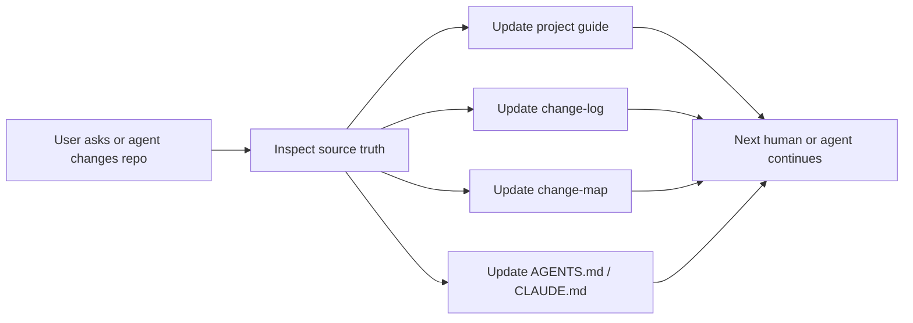

<div align="center">
  <h1>
    
    Repo-Docs:
  </h1>
  <p><strong>Keep project understanding alive while agents keep coding.</strong></p>
</div>

<p align="center">
  Turn coding-agent conversations into living docs, progress logs, change maps,
  and handoff-ready project memory.
</p>

<p align="center">
  <a href="#quick-start">Quick Start</a> ·
  <a href="#latest-updates">Latest Updates</a> ·
  <a href="#what-is-repo-docs">What is Repo-Docs?</a> ·
  <a href="#demonstration">Demonstration</a> ·
  <a href="#quality-bar">Quality Bar</a>
</p>

<p align="center">
  <a href="README.md">English</a> ·
  <a href="README_CN.md">中文 README</a>
</p>

---

## Latest Updates

> Repo-Docs is designed for the way coding-agent projects actually evolve:
> questions, changes, milestones, handoffs, and documentation updates happen in
> the same loop.
> If this workflow is useful, a GitHub star 🌟 helps more agent builders find it.

- **2026-06-23**: Added Chinese overlay support through `repo-docs-zh`.
- **2026-06-23**: Published the first README structure, project guide contract,
  reference standard, and example prompts.

## Quick Start

There are two common ways to install the skill.

### Natural-language install

Give this project link to your coding agent:

```text
Install the repo-docs skill from this project:
https://github.com/YurunChen/Repo-Docs

Make both repo-docs and repo-docs-zh available in my agent skill directory.
```

### Command install

From this project directory, copy the skill files into your agent skill
directory:

```bash
mkdir -p ~/.agents/skills/repo-docs
cp SKILL.md REFERENCE.md EXAMPLES.md ~/.agents/skills/repo-docs/
mkdir -p ~/.agents/skills/repo-docs-zh
cp repo-docs-zh/SKILL.md ~/.agents/skills/repo-docs-zh/SKILL.md
```

Then invoke it naturally:

```text
Use repo-docs-zh to rebuild this repo's project guide.
```

## What is Repo-Docs?

`repo-docs` is a coding-agent skill for maintaining project understanding while
the project is being built. As users ask questions, change code, finish
milestones, or hand work to another agent, `repo-docs` keeps the project guide,
progress log, change map, and agent instructions aligned with the actual repo.

Vibe coding accelerates implementation, but it also creates a project memory
gap. Code changes quickly; the reasons, decisions, risks, and current state
often stay trapped in chat history. `repo-docs` turns those interactions into
durable Markdown documentation future humans and agents can continue from.

## Why It Matters

| Without `repo-docs` | With `repo-docs` |
| --- | --- |
| Decisions stay buried in chat | Decisions land in project docs |
| New agents re-read the repo from zero | New agents start from the guide |
| Progress is remembered informally | Milestones are recorded in `change-log.md` |
| Planned work mixes with implemented facts | `Planned`, `Decided`, `Implemented`, and `Unknown` stay separate |
| Handoffs depend on personal memory | Handoffs use docs, `AGENTS.md`, and current source evidence |

## Core Capabilities

| Capability | What it keeps current |
| --- | --- |
| **Live project memory** | The current project thesis, workflow, contracts, and caveats |
| **Progress log** | Meaningful work, decisions, verification, and outcomes in `change-log.md` |
| **Change map** | Future edits, likely files, risks, and checks in `change-map.md` |
| **Agent continuity** | Repo-specific rules and guide policy in `AGENTS.md` / `CLAUDE.md` |
| **Seed project support** | Goals, decisions, planned work, and unknowns before code exists |
| **Chinese guide support** | Natural Chinese docs through `repo-docs-zh`, with source identifiers preserved |

## Demonstration

A normal coding-agent session becomes a documentation loop:



After a milestone, `repo-docs` can leave behind:

| File | What it preserves |
| --- | --- |
| `docs/project-guide/README.md` | Current project mental model |
| `docs/project-guide/change-log.md` | What changed, why, and how it was verified |
| `docs/project-guide/change-map.md` | Next edits, likely files, risks, and checks |
| `AGENTS.md` / `CLAUDE.md` | Rules for the next coding agent |

## Modes

| Mode | Use it when | Output focus |
| --- | --- | --- |
| **Seed** | The project is new or nearly empty | Goals, decisions, planned work, unknowns |
| **Build** | The repo needs its first guide | Main workflow, module map, contracts |
| **Sync** | Code, docs, data, scripts, or experiments changed | Current docs aligned with source truth |
| **Question refinement** | A repo question reveals missing knowledge | Patch the guide, then answer from evidence |

## Example Prompts

```text
Use repo-docs to create a project guide for this repository.
```

```text
Use repo-docs for this empty project. Create a seed guide that separates
Implemented, Decided, Planned, and Unknown items.
```

```text
Use repo-docs-zh. Read the current docs and source, then update the guide after
this refactor. Record what changed in change-log.md.
```

```text
Answer this architecture question from source evidence. If the guide is missing
the answer, patch the relevant docs before replying.
```

```text
Prepare this repo for handoff. Sync README.md, docs/project-guide/, AGENTS.md,
and memory pointers so the next agent can continue.
```

## What It Produces

The default output is a Markdown guide under:

```text
docs/project-guide/
  README.md
  glossary.md
  flows.md
  change-map.md
  change-log.md
  modules/
  references/
```

For seed projects, the guide stays smaller:

```text
docs/project-guide/
  README.md
  change-map.md
  change-log.md
  glossary.md                 # optional
  references/
    decisions.md              # optional
```

## Built For

- researchers iterating on benchmark, eval, and experiment repos
- engineers using Claude Code, Cursor, or other coding agents daily
- teams that need handoffs between humans and agents
- projects where prompts, scripts, configs, data, and results change together
- new projects that need a project memory baseline before code exists
- maintainers who want docs updated as work happens, not after everyone forgets

## Documentation Sync Model

`repo-docs` keeps three project-knowledge layers aligned during normal work:

| Layer | Audience | Responsibility |
| --- | --- | --- |
| `README.md` and `docs/` | Human teammates, downstream users, future agents | Architecture, onboarding, operations, examples, contracts, references |
| Root `AGENTS.md` / `CLAUDE.md` | Future agents inside the repo | Hard boundaries, commands, environment rules, red lines, guide policy |
| Agent memory, when available | The agent across sessions | User preferences, recent lessons, cross-project pointers |

Docs become the authority for current project understanding. Memory stays thin
and pointer-oriented.

## What's Included

```text
repo-docs/
├── README.md
├── README_CN.md
├── SKILL.md
├── REFERENCE.md
├── EXAMPLES.md
└── repo-docs-zh/
    └── SKILL.md
```

| File | Purpose |
| --- | --- |
| `README.md` | English project homepage and quick start. |
| `README_CN.md` | Chinese project homepage and quick start. |
| `SKILL.md` | Main skill entrypoint: triggers, modes, guide shape, writing standard, and verification checklist. |
| `REFERENCE.md` | Detailed standards for evidence discovery, seed projects, document types, sync strategy, and quality checks. |
| `EXAMPLES.md` | Lightweight output skeletons for a project guide, module doc, and follow-up behavior. |
| `repo-docs-zh/SKILL.md` | Chinese-language overlay for project guides written in Chinese. |

## Quality Bar

A good `repo-docs` guide is useful after the chat ends. A newcomer should be
able to read it and explain the repo in their own words, reproduce one real
workflow, identify the important contracts, and know where to make a safe
change.

Important claims should be marked by confidence:

- `Confirmed`: backed by code, tests, config, data, docs, or artifacts
- `Inferred`: reasoned from nearby evidence and named as inference
- `Unknown` / `未确认`: awaiting verification

For seed projects, planned work must stay visibly separate from implemented
facts.

## Acknowledgements

- [codebase-to-course](https://github.com/zarazhangrui/codebase-to-course)
- [neat-freak](https://github.com/KKKKhazix/khazix-skills)

## Support

If `repo-docs` helps your agent sessions leave cleaner project knowledge behind,
a GitHub star 🌟 helps others find this workflow.

---

<div align="center">
  <p><strong>Repo-Docs:</strong> Keep project understanding alive while agents keep coding.</p>
  
  <p><em>Thanks for visiting Repo-Docs.</em></p>
  
</div>
