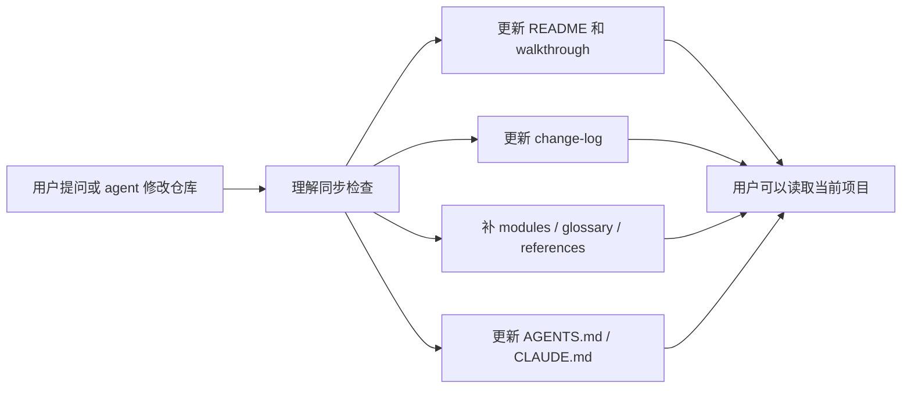

<div align="center">
  <h1>
    Repo-Docs: 让你跟得上 agent 写出来的代码。
  </h1>
</div>

<p align="center">
  Vibe coding 让项目长得很快。Repo-Docs 把解释、决策、进度和下一步放回仓库，贴着代码一起走。
</p>

<p align="center">
  <a href="#最新更新">最新更新</a> ·
  <a href="#repo-docs-是什么">Repo-Docs 是什么？</a> ·
  <a href="#演示">演示</a> ·
  <a href="#快速开始">快速开始</a> ·
  <a href="#质量标准">质量标准</a>
</p>

<p align="center">
  <a href="README.md">English</a> ·
  <a href="README_CN.md">中文 README</a>
</p>

<p align="center">
  
</p>

---

## 最新更新

> 新版以真实 walkthrough 为入口，默认输出到根目录 `repo-docs/`，支持中文文档，也支持空项目的 Seed 模式。
> 如果 Repo-Docs 帮你跟上 agent 写出来的项目，欢迎给这个项目一个 star 🌟。

- **2026-06-23**：通过 `repo-docs-zh` 增加中文覆盖层支持。
- **2026-06-23**：增加 walkthrough-first 文档形态，入口是
  `repo-docs/walkthroughs/one-real-run.md`。
- **2026-06-23**：发布第一版 README 结构、repo-docs 契约、reference 标准和示例 prompt。

## Repo-Docs 是什么？

Vibe coding 让代码出现得很快。文件变了，决策变了，下一步也变了；但为什么这么改、哪些已经确定、哪些只是计划，常常还留在聊天记录里。几轮会话之后，项目还能跑，用户却不一定还能完整说清它为什么长成这样。

`repo-docs` 做的事很简单：降低用户和 vibe coding 代码之间的理解差距。它让 coding agent 在工作过程中持续维护 `repo-docs/` 文档，并先从一条真实 walkthrough 讲起：用户能观察到什么，代码、数据和状态怎么走，改了什么，为什么改，什么已经决定，什么只是计划，什么还没验证。

## 核心能力

**先懂仓库在干什么，再记路径。**  
跟一条真实行为走到底。讲清少数几个真正撑住设计的概念。再指向代码在哪、你怎么确认自己没理解错。不是目录导览，也不是假装什么都看过。

**解释写在仓库里。**  
文档落在 `repo-docs/`，就是 Markdown：walkthrough、概念页、术语表、查表区。不是幻灯片，也不是每个文件抄一遍。下周的你，或下一个 agent，冷启动也能顺着读下去。

**文档跟着代码走。**  
不用专门停下手头活去「写文档」。仓库变了，或一个问题暴露出说明已经落后，就在同一段对话里补最小的一页——把误解修掉就行。

**提问会让 guide 变好。**  
问机制、问路径。文档里还没有的地方，就去看源码、补对应页，再带着链接回答——告诉你这份理解现在住在哪。

## 演示

一次普通的 coding-agent 会话会变成一个文档同步循环：



一个阶段结束后，Repo-Docs 会让仓库更容易继续：

| 文件 | 保留下来的内容 |
| --- | --- |
| `repo-docs/README.md` | 当前项目说明 |
| `repo-docs/walkthroughs/one-real-run.md` | 从入口到输出的一条真实行为路径 |
| `repo-docs/modules/` | walkthrough 提到的概念的深入解释 |
| `repo-docs/references/` | 精确名称、字段、命令和契约 |
| `repo-docs/glossary.md` | 项目中重复术语的白话含义 |
| `repo-docs/change-log.md` | 改了什么、为什么改、同步锚点和验证方式 |
| `AGENTS.md` / `CLAUDE.md` | 给下一个 coding agent 的规则 |

## 快速开始

### 自然语言安装

把项目链接交给你的 coding agent：

```text
Install the repo-docs skill from this project:
https://github.com/YurunChen/repo-docs-skills

Make both repo-docs and repo-docs-zh available in my agent skill directory.
```

### 命令安装

在项目目录下执行：

```bash
mkdir -p ~/.agents/skills/repo-docs
cp SKILL.md REFERENCE.md EXAMPLES.md ~/.agents/skills/repo-docs/
mkdir -p ~/.agents/skills/repo-docs-zh
cp repo-docs-zh/SKILL.md ~/.agents/skills/repo-docs-zh/SKILL.md
```

安装后可以这样使用：

```text
请为这个项目创建中文 repo docs。
```

## 工作模式

| 模式 | 适用场景 | 输出重点 |
| --- | --- | --- |
| Seed | 项目刚开始或几乎没有代码 | 目标、决策、计划、未知项 |
| Build | 项目需要第一版 repo docs | 一条真实 walkthrough、模块地图、关键契约 |
| Sync | 代码、文档、数据、脚本或实验变了 | 当前文档和源码事实同步 |
| Question refinement | 一个问题暴露文档缺口 | 先补文档，再基于证据回答 |

## 示例 Prompt

项目第一次建立文档时，可以明确调用一次：

```text
使用 repo-docs skill 为这个项目创建文档。
```

之后正常对话即可。coding agent 应该在代码变化、架构问题、说明过期或阶段交接
时自行判断是否需要同步 `repo-docs/`、`change-log.md` 和项目里的 agent 规则文件。

## 输出结构

默认输出是生成在 `repo-docs/` 目录下的 Markdown 文档包：

```text
repo-docs/
  README.md
  walkthroughs/
    one-real-run.md      # 非 Seed 项目默认需要
  glossary.md
  flows.md              # 可选，用于多路径/多状态总图
  change-log.md
  modules/
  references/
```

空项目生成的文档会更轻量：

```text
repo-docs/
  README.md
  change-log.md
  glossary.md                 # optional
  references/
    decisions.md              # optional
```

## 适合谁

- 想在使用 coding agents 时仍然掌控项目的人
- 代码变化速度快过聊天记录解释速度的项目
- 想审查和引导 agent 写出来的代码的用户
- benchmark、eval、experiment 和 prompt-heavy 仓库
- 代码还没开始写、但需要先留下记忆基线的新项目
- 希望仓库能自己解释自己的维护者

## 文档同步模型

`repo-docs` 会在正常工作过程中同步三层项目知识：

| 层级 | 读者 | 职责 |
| --- | --- | --- |
| `README.md` 和 `repo-docs/` | 用户、队友、未来 agent | 架构、walkthrough、上手路径、操作、示例、契约、references |
| 根目录 `AGENTS.md` / `CLAUDE.md` | 仓库里的未来 agent | 硬边界、命令、环境规则、红线、repo-docs 策略 |
| 可用时的 agent memory | 跨会话的 agent | 用户偏好、近期经验、跨项目指针 |

文档成为当前项目理解的权威来源。Memory 保持轻量，只存指针和少量经验。

## 包含内容

```text
repo-docs/
├── README.md
├── README_CN.md
├── SKILL.md
├── REFERENCE.md
├── EXAMPLES.md
└── repo-docs-zh/
    └── SKILL.md
```

| 文件 | 用途 |
| --- | --- |
| `README.md` | 英文项目主页和快速开始。 |
| `README_CN.md` | 中文项目主页和快速开始。 |
| `SKILL.md` | 主 skill 入口：触发条件、模式、repo-docs 形态、写作标准和验证清单。 |
| `REFERENCE.md` | 证据发现、Seed 项目、文档类型、同步策略和质量检查的详细标准。 |
| `EXAMPLES.md` | repo docs、walkthrough、module docs 和后续行为的轻量输出骨架。 |
| `repo-docs-zh/SKILL.md` | 用于中文 repo docs 的中文覆盖层。 |

## 质量标准

好的 `repo-docs/` 文档应该在会话结束后仍然有用。新读者应该能通过它理解项目目标，从一个可观察入口追踪到输出或产物，识别关键契约，并用测试或命令验证自己的理解。

重要结论需要标明可信度：

- `Confirmed`：有源码、测试、配置、数据、文档或产物支撑
- `Inferred`：由附近证据推断，并明确标记为推断
- `Unknown` / `未确认`：尚未验证

对于 Seed 项目，计划中的工作必须和已经实现的事实清楚分开。

## 致谢

- [codebase-to-course](https://github.com/zarazhangrui/codebase-to-course)
- [neat-freak](https://github.com/KKKKhazix/khazix-skills)

## 支持

如果 Repo-Docs 帮你跟上 agent 写出来的代码，欢迎给这个 repo 一个 star 🌟。

---

<div align="center">
  <p><strong>Repo-Docs:</strong> 让你跟得上 agent 写出来的代码。</p>
  <p><em>感谢访问 Repo-Docs。</em></p>
  
</div>
