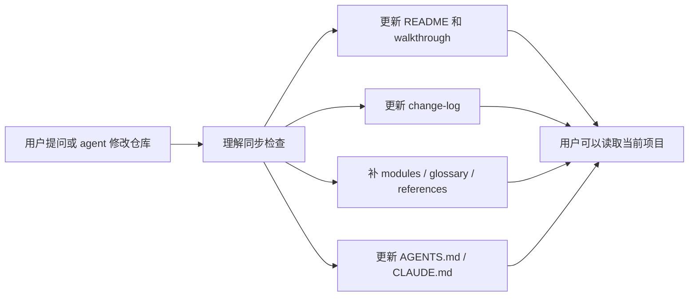

<div align="center">
  
  <h1>Repo-Docs: 让你跟得上 agent 写出来的代码。</h1>
  <p><strong>给 agent 写出来的代码，留一张可验证的证据地图。</strong></p>
  <p>
    Vibe coding 让代码跑得很快，但理解常常还留在聊天里。Repo-Docs
    把一次真实运行写成 walkthrough、概念页、reference 和同步规则，
    让解释跟源码一起留在仓库里。
  </p>
  <p>
    <a href="http://xhslink.com/o/9M27ebWDaD3">
      
    </a>
    <a href="https://yurunchen.github.io/repo-docs-skills/">
      
    </a>
  </p>
</div>

<p align="center">
  <a href="README.md">English README</a> |
  <a href="skills/repo-docs/SKILL.md">Skill contract</a> |
  <a href="https://yurunchen.github.io/repo-docs-skills/">项目主页</a> |
  <a href="#30-秒安装">安装</a>
</p>

<p align="center">
  <a href="#为什么现在需要它"><strong>为什么现在</strong></a> |
  <a href="#repo-docs-循环"><strong>工作循环</strong></a> |
  <a href="#它会生成什么"><strong>产物</strong></a> |
  <a href="#质量标准"><strong>质量标准</strong></a>
</p>

<p align="center">
  
</p>

<p align="center">
  <em>先理解仓库，再记路径。</em>
</p>

---

## 它解决什么问题

<table>
  <tr>
    <td width="50%" valign="top">
      <h3>Agent 快速写出来的仓库常常这样</h3>
      <ul>
        <li>代码已经变了，但为什么这么变还留在聊天记录里。</li>
        <li>文件很多，却没人能说清一条真实行为怎么从入口走到输出。</li>
        <li>README、源码、测试和 agent memory 互相漂移。</li>
        <li>下一个 agent 又要重新发现同一批上下文。</li>
      </ul>
    </td>
    <td width="50%" valign="top">
      <h3>Repo-Docs 留下这些东西</h3>
      <ul>
        <li>一条真实运行的 walkthrough，从可观察入口讲到产物。</li>
        <li>少数真正支撑设计的概念页。</li>
        <li>源码证据和质量审查页。</li>
        <li>让未来 agent 按当前源码同步文档的根规则。</li>
      </ul>
    </td>
  </tr>
</table>

Repo-Docs 不是文件树导览、API dump，也不是聊天记录整理。它做的是给读者建立一个
repo model：这个仓库在做什么，行为怎么流动，证据在哪里，后续怎么保持同步。

## 为什么现在需要它

AI coding 已经不是小众玩法。两篇 2026 年的开源研究让这个趋势变得可量化：
[AIDev](https://arxiv.org/abs/2602.09185) 报告了 932,791 个 agent-authored
pull requests，覆盖 116,211 个 GitHub 仓库；另一篇
[180M 仓库的多方法普查](https://arxiv.org/abs/2606.24429) 则显示，很多
agent 痕迹会被单一信号漏掉。

增长带来的新维护问题是：代码是真的，但项目理解经常是临时的。Repo-Docs
把这层理解做成仓库里的可验证资产。

## Repo-Docs 循环



这个循环刻意保守。好的同步不是把所有页面都润色一遍，而是修掉最容易误导下一个读者的那一页。

## 它会生成什么

| 产物 | 职责 |
| --- | --- |
| `repo-docs/README.md` | 帮读者定位项目，并指向第一条有用路径。 |
| `walkthroughs/one-real-run.md` | 沿着一条真实行为，从入口讲到输出。 |
| `modules/` | 解释 walkthrough 中出现的稳定概念。 |
| `references/` | 保存源码证据和可选质量检查。 |
| `glossary.md` | 把项目内重复术语翻译成白话。 |
| `change-log.md` | 记录文档更新、验证方式和 sync anchor。 |
| `AGENTS.md` / `CLAUDE.md` | 告诉未来 coding agent 什么时候、怎么保持文档同步。 |

## 30 秒安装

把这段自然语言安装请求交给你的 coding agent：

```text
Install the repo-docs skill from this project:
https://github.com/YurunChen/repo-docs-skills

Make both repo-docs and repo-docs-zh available in my agent skill directory.
```

然后在任意仓库里这样调用：

```text
Use the repo-docs skill to create docs for this repository.
```

<details>
<summary>命令行安装</summary>

如果你更喜欢 shell，可以用下面的命令。这里用的是 GitHub 仓库 raw 文件 URL；GitHub 会在重定向后通过 raw content host 返回脚本原文。

```bash
curl -fsSL https://github.com/YurunChen/repo-docs-skills/raw/main/install.sh | bash
```

Windows PowerShell：

```powershell
irm https://github.com/YurunChen/repo-docs-skills/raw/main/install.ps1 | iex
```

从当前源码目录安装：

```bash
./install.sh

# 安装到所有常见位置：~/.codex/skills、~/.claude/skills、~/.agents/skills
./install.sh --agent all

# 安装到一个明确的 skills 目录
./install.sh --target ~/.agents/skills
```

</details>

## 自然调用

```text
使用 repo-docs skill 为这个仓库创建文档。
```

```text
使用 repo-docs-zh 为这个项目创建中文 repo guide。
```

```text
结合 repo-docs 和当前源码，解释这个子系统怎么工作。
```

## 工作模式

| 模式 | 适用场景 | 保存什么 |
| --- | --- | --- |
| Seed | 仓库刚开始，几乎没有运行证据 | 目标、决策、计划和未知项 |
| Build | 仓库需要第一版 guide | Walkthrough、概念页、reference、术语表和同步规则 |
| Sync | 仓库问题或 guide 覆盖的行为可能让文档过时 | 最小的、否则会误导读者的归属页面 |
| Cleanup | 用户要求删除生成文档 | 文档包和过期的根 agent 指针 |
| Question refinement | 一个问题暴露了错误读者模型 | 修正后的页面，以及指向它的回答 |

## 验证

```bash
python skills/repo-docs/scripts/validate_repo_docs.py /path/to/repo-docs --repo-root /path/to/repo
```

小项目可以用 `--lite`；还没有实现证据的新项目用 `--seed`。`--repo-root`
会检查源码定位和 anchor 后的漂移。

## 质量标准

好的 Repo-Docs 文档包应该在对话结束之后仍然有用。

| 原则 | 含义 |
| --- | --- |
| 先讲行为，再讲清单 | 先讲一条真实 workflow，再列文件。 |
| 先给读者抓手，再给定位 | 先解释概念，再链接到路径、函数、字段或命令。 |
| 一个稳定事实，一个归属页 | 概念和必要细节进 modules，证据和质量检查进 references，历史进 change-log。 |
| 证据保持可见 | 当前源码、测试、配置、数据、命令和产物优先于 memory 或旧文档。 |
| 修补保持克制 | 理解漂移时，只更新最小的归属页面。 |

## 源码结构

```text
repo-docs-skills/
├── skills/
│   ├── repo-docs/        # 可安装 skill 包
│   └── repo-docs-zh/     # 中文语言 overlay
├── site/                 # 官网源码
├── docs/                 # GitHub Pages 发布目录
├── install.sh
├── install.ps1
├── README.md
└── README_CN.md
```

可安装的 skill 源码只放在 `skills/`。`site/` 是官网源码，`docs/` 是 GitHub Pages 发布目录。

## 安装后的内容

```text
<skills-dir>/
├── repo-docs/
│   ├── SKILL.md
│   ├── REFERENCE.md
│   ├── WRITING.md
│   ├── PAGE_RULES.md
│   ├── SCOPE_MODES.md
│   ├── SYNC_RULES.md
│   ├── QUALITY_RULES.md
│   ├── EXAMPLES.md
│   ├── validate_repo_docs.py
│   └── scripts/
│       └── validate_repo_docs.py
└── repo-docs-zh/
    └── SKILL.md
```

## 致谢

Repo Docs Skills 由浙江大学 [AI4GC Lab](https://ai4gc.org/) 开发。

- [codebase-to-course](https://github.com/zarazhangrui/codebase-to-course)
- [neat-freak](https://github.com/KKKKhazix/khazix-skills)

---

<div align="center">
  <strong>Repo-Docs:</strong> 让仓库自己解释自己。
  <br />
  <sub>为快速变化的代码留下 walkthrough、证据、reference、同步规则和项目记忆。</sub>
  <br />
  <br />
  
</div>
