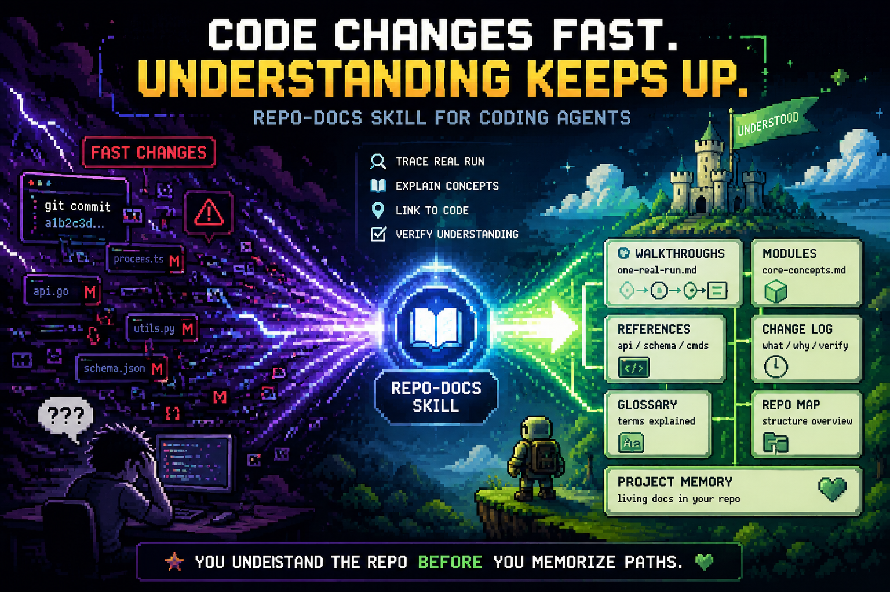
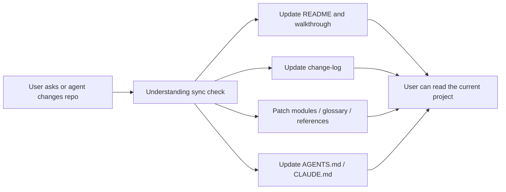

<div align="center">
  
  <h1>Repo-Docs: Keep up with the code your agents write.</h1>
  <p><strong>An evidence atlas for agent-built code.</strong></p>
  <p>
    Vibe coding makes code move faster than memory. Repo-Docs turns each real
    run into walkthroughs, concepts, references, and sync rules that live beside
    the source.
  </p>
  <p>
    <a href="http://xhslink.com/o/9M27ebWDaD3">
      
    </a>
    <a href="https://yurunchen.github.io/repo-docs-skills/">
      
    </a>
  </p>
</div>

<p align="center">
  <a href="README_CN.md">Chinese README</a> |
  <a href="SKILL.md">Skill contract</a> |
  <a href="https://yurunchen.github.io/repo-docs-skills/">Project homepage</a> |
  <a href="#install-in-30-seconds">Install</a>
</p>

<p align="center">
  <a href="#why-this-exists-now"><strong>Why now</strong></a> |
  <a href="#the-repo-docs-loop"><strong>The loop</strong></a> |
  <a href="#what-it-builds"><strong>Artifacts</strong></a> |
  <a href="#quality-bar"><strong>Quality bar</strong></a>
</p>

<p align="center">
  
</p>

<p align="center">
  <em>Understand the repo before you memorize paths.</em>
</p>

---

## The Problem

<table>
  <tr>
    <td width="50%" valign="top">
      <h3>Agent-built repos often feel like this</h3>
      <ul>
        <li>Code changed quickly, but the reason stayed in chat.</li>
        <li>Files exist, yet no one can explain the real behavior path.</li>
        <li>README, source, tests, and agent memory drift apart.</li>
        <li>The next agent starts by rediscovering the same context.</li>
      </ul>
    </td>
    <td width="50%" valign="top">
      <h3>Repo-Docs leaves this behind</h3>
      <ul>
        <li>A walkthrough of one real run from entry to output.</li>
        <li>Concept pages for the few ideas that actually matter.</li>
        <li>Evidence pages for source proof and quality review.</li>
        <li>A sync rule that keeps future answers tied to current source.</li>
      </ul>
    </td>
  </tr>
</table>

Repo-Docs is not a file-tree tour, a generated API dump, or a chat transcript.
It is a small project guide that tells a reader what the repo does, how the
behavior moves, where the proof lives, and how to keep that understanding fresh.

## Why This Exists Now

AI coding is no longer a niche workflow. Two 2026 open-source studies make the
scale visible: [AIDev](https://arxiv.org/abs/2602.09185) reports 932,791
agent-authored pull requests across 116,211 GitHub repositories, while a
[multi-method census of 180 million repositories](https://arxiv.org/abs/2606.24429)
shows that many agent traces are missed by single-signal detection.

That growth creates a new maintenance problem: the code may be real, but the
project understanding is often temporary. Repo-Docs gives coding agents a
repeatable way to preserve the reasoning layer inside the repository itself.

## The Repo-Docs Loop



The loop is intentionally conservative. A good update touches the page that
would otherwise mislead the next reader, not every page that could be polished.

## What It Builds

| Artifact | Job |
| --- | --- |
| `repo-docs/README.md` | Orient the reader and point to the first useful path. |
| `walkthroughs/one-real-run.md` | Follow one real behavior from observable entry to output. |
| `modules/` | Explain durable concepts the walkthrough names. |
| `references/` | Hold source evidence and optional quality review. |
| `glossary.md` | Translate repeated project terms into plain meaning. |
| `change-log.md` | Record meaningful guide work, verification, and sync anchors. |
| `AGENTS.md` / `CLAUDE.md` | Tell future coding agents when and how to keep docs current. |

## Install In 30 Seconds

Give this natural-language install request to your coding agent:

```text
Install the repo-docs skill from this project:
https://github.com/YurunChen/repo-docs-skills

Make both repo-docs and repo-docs-zh available in my agent skill directory.
```

Then ask it to run the skill in any repository:

```text
Use the repo-docs skill to create docs for this repository.
```

<details>
<summary>Command-line install</summary>

Use this when you prefer a shell install. The URL is a GitHub repository raw-file URL; GitHub serves the raw script bytes through its raw content host after redirect.

```bash
curl -fsSL https://github.com/YurunChen/repo-docs-skills/raw/main/install.sh | bash
```

Windows PowerShell:

```powershell
irm https://github.com/YurunChen/repo-docs-skills/raw/main/install.ps1 | iex
```

From this source checkout:

```bash
./install.sh

# Install into all known locations: ~/.codex/skills, ~/.claude/skills, ~/.agents/skills
./install.sh --agent all

# Install into one explicit skills directory
./install.sh --target ~/.agents/skills
```

</details>

## Use It Naturally

```text
Use the repo-docs skill to create docs for this repository.
```

```text
Use repo-docs-zh to create a Chinese repo guide for this project.
```

```text
Explain how this subsystem works using repo-docs and the current source.
```

## Modes

| Mode | Use when | What it preserves |
| --- | --- | --- |
| Seed | The repo is new or has little runtime evidence | Goals, decisions, planned work, and unknowns |
| Build | The repo needs its first guide | Walkthrough, concepts, references, glossary, and sync rule |
| Sync | A repo question or guide-covered behavior may make docs stale | The smallest page that would otherwise mislead |
| Cleanup | The user asks to remove generated docs | Docs package and stale root-agent pointers |
| Question refinement | A question exposes a wrong reader model | The corrected page, then an answer linked to it |

## Validation

```bash
python skills/repo-docs/scripts/validate_repo_docs.py /path/to/repo-docs --repo-root /path/to/repo
```

Use `--lite` for small projects and `--seed` for repositories that still need
status-labeled plans instead of implementation claims. `--repo-root` checks
source locators and post-anchor drift.

## Quality Bar

A good Repo-Docs package is useful after the chat ends.

| Principle | Meaning |
| --- | --- |
| Behavior before inventory | Teach one real workflow before listing files. |
| Reader handles before locators | Explain the concept, then link to the exact path, function, field, or command. |
| One durable fact, one home | Concepts and needed details live in modules; evidence and quality audit live in references; history lives in the change log. |
| Evidence stays visible | Current source, tests, config, data, commands, and artifacts outrank memory or stale docs. |
| Patches stay surgical | When understanding drifts, update the smallest page that fixes the reader model. |

## Source Layout

```text
repo-docs-skills/
├── skills/
│   ├── repo-docs/        # installable skill package
│   └── repo-docs-zh/     # Chinese language overlay
├── site/                 # homepage source
├── docs/                 # GitHub Pages publish tree
├── install.sh
├── install.ps1
├── README.md
└── README_CN.md
```

The installable skill source lives under `skills/`. The `site/` directory is homepage source, while `docs/` is the GitHub Pages publish tree.

## Installed Package Contents

```text
<skills-dir>/
├── repo-docs/
│   ├── SKILL.md
│   ├── REFERENCE.md
│   ├── WRITING.md
│   ├── PAGE_RULES.md
│   ├── SCOPE_MODES.md
│   ├── SYNC_RULES.md
│   ├── QUALITY_RULES.md
│   ├── EXAMPLES.md
│   ├── validate_repo_docs.py
│   └── scripts/
│       └── validate_repo_docs.py
└── repo-docs-zh/
    └── SKILL.md
```

## Acknowledgements

Repo Docs Skills is developed by the [AI4GC Lab](https://ai4gc.org/) at Zhejiang University.

- [codebase-to-course](https://github.com/zarazhangrui/codebase-to-course)
- [neat-freak](https://github.com/KKKKhazix/khazix-skills)

---

<div align="center">
  <strong>Repo-Docs:</strong> make the repository explain itself.
  <br />
  <sub>Walkthroughs, evidence, references, sync rules, and project memory for fast-moving code.</sub>
  <br />
  <br />
  
</div>
